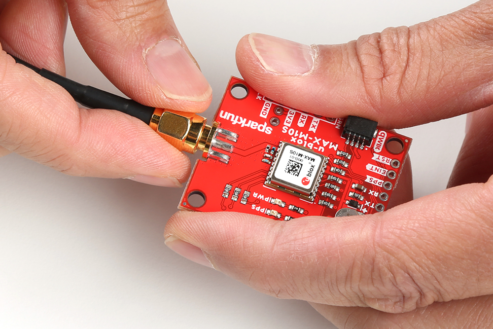
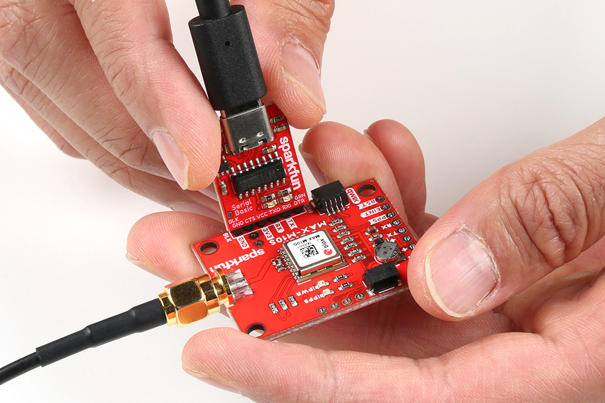

At a minimum, you will need to attach an external antenna to the MAX-M10S, supply 3.3V power, and connect to one of the board's peripherals.

### Attaching an External Antenna

Plug in one of our patch antennas with SMA connector to the GPS board. Secure the connection using the hex nut until it is finger-tight.

### I2C

One method to communicate with the MAX-M10S is through I2C. The Qwiic connect system makes it quick and easy to connect the board to your system using a polarized cable. For embedded projects, you can use a Qwiic-enabled Arduino development board like the [RedBoard Plus](https://www.sparkfun.com/products/18158) and its [associated USB cable](https://www.sparkfun.com/products/15425). Then plug a Qwiic cable between the RedBoard Plus and the SparkFun MAX-M10S.

!!! note
    The RedBoard Plus includes a switch to adjust the logic levels to either 5V or 3.3V. It does not matter what side the switch is on for this setup to communicate with the MAX-M10S since there are logic level converters included before the Qwiic connector.

If you're going to be [soldering](https://learn.sparkfun.com/tutorials/how-to-solder-through-hole-soldering) to the through hole pins for I2C functionality, then just attach the following lines between your chosen microcontroller's I2C and the MAX-M10S:

* SDA to SDA
* SCL to SCL
* 3.3V to 3.3V
* GND to GND

### UART

A second method to communicate with the MAX-M10S is through its serial UART. You can directly connect the GPS to the computer by connecting a USB-to-serial converter to the industry standard serial connection (aka the 'FTDI' pinout). In this case, we used an FTDI but you can use another USB-to-serial converter like the CH340. Just make sure to match the silkscreen (GRN to GRN and BLK to BLK). For a secure connection, you&apos;ll need to [solder](https://learn.sparkfun.com/tutorials/how-to-solder-through-hole-soldering) male header pins or wires to the MAX-M10S.

You could also connect the pins to a microcontroller like the RedBoard Plus as long as the switch for the logic levels are flipped to the 3.3V side before powering the board up. You'll need to do a little bit more work as opposed to using Qwiic connect system. You'll need to attach the following lines between your chosen microcontroller's UART and the MAX-M10S:

* Tx to Rx
* Rx to Tx
* 3.3V to 3.3V
* GND to GND
